# Lattice Symmetry Visualization

Note: Valid lattice structures occur for n = 2, 3, 4, and 6.

The purple arrows are some arbitrarily chosen primitive vectores.

### n = 3
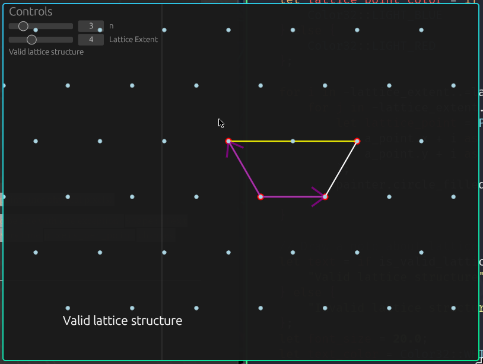

### n = 4
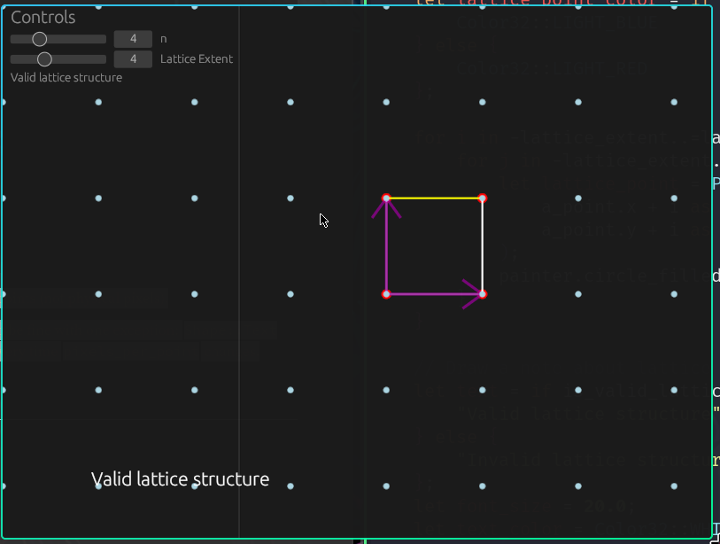

### n = 5
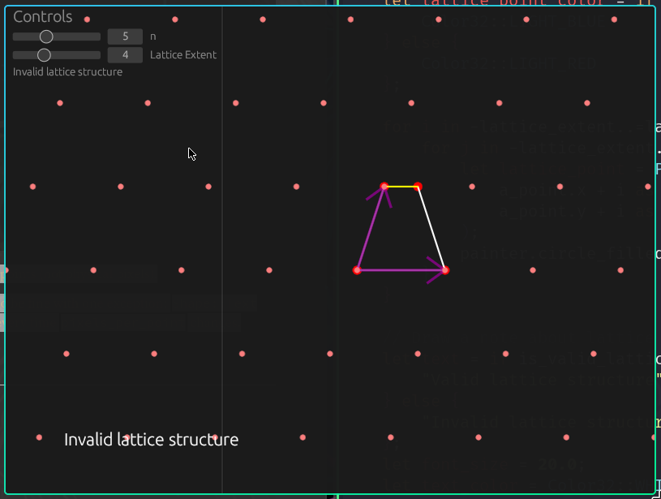

### n = 6
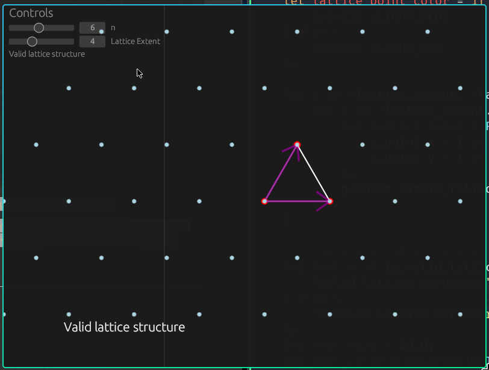

### n = 7
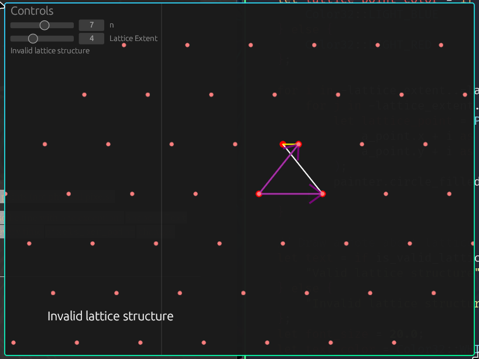

### n = 8
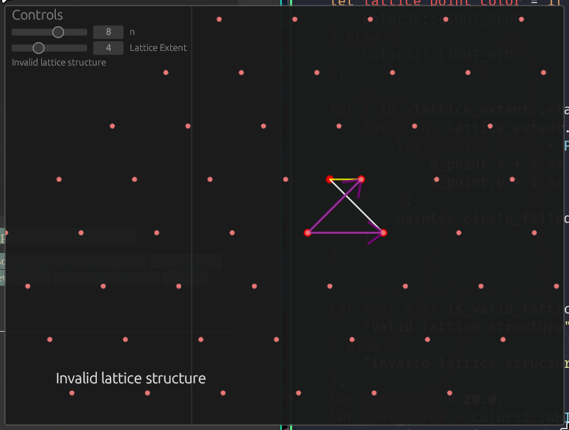

### n = 9
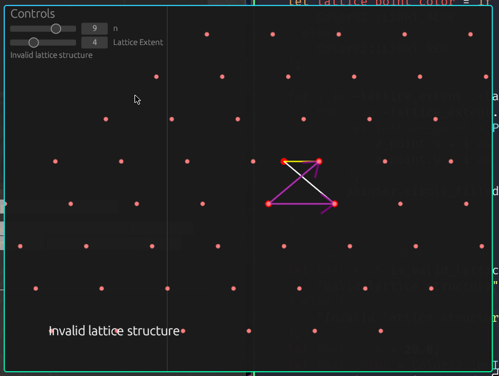

### n = 10
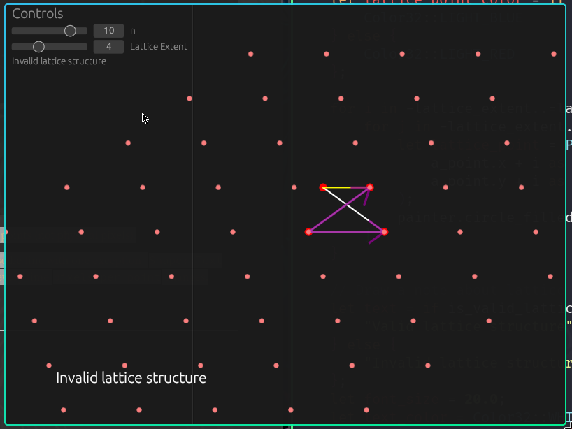

### n = 11
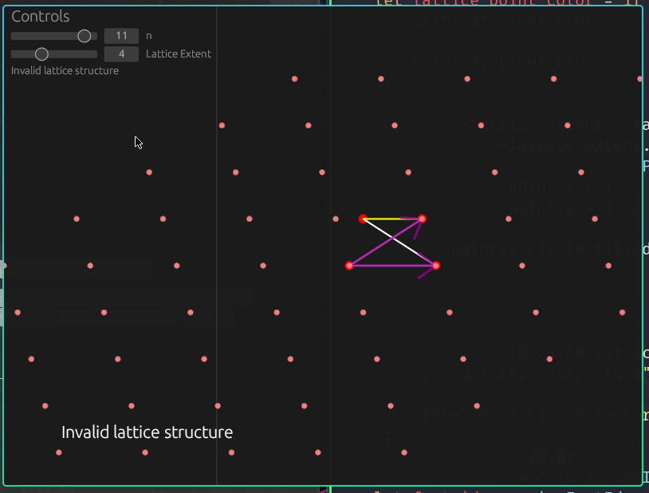

### n = 12
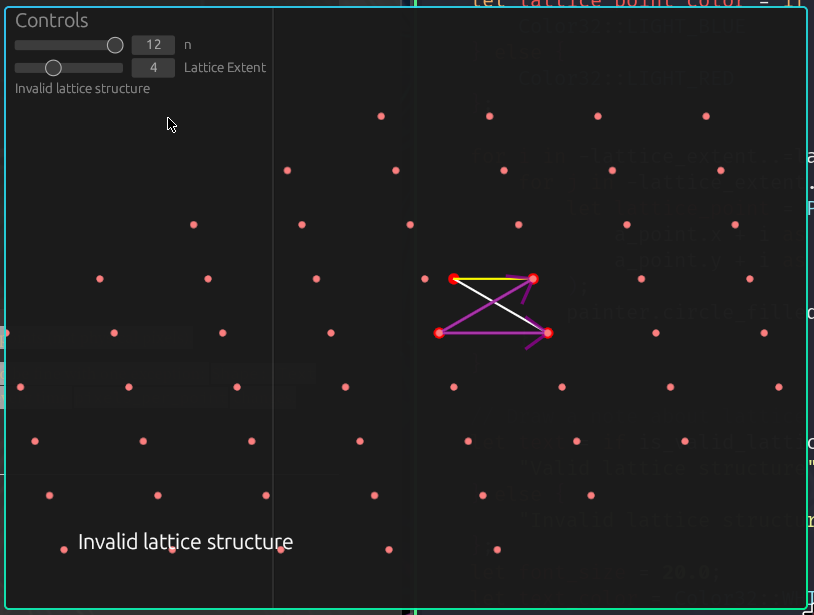

### n = 1
This shows "valid" but actually is the same lattice as n=2 probably not valid idk, but its more of a trivial case anyways.
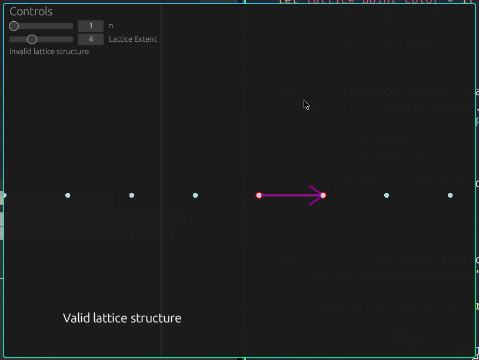

### n = 2
Arrows make the points a bit less visible. We can only choose linearly dependent vectors here.
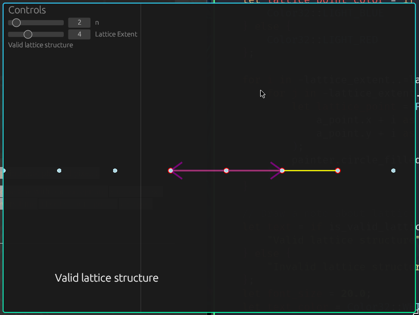
